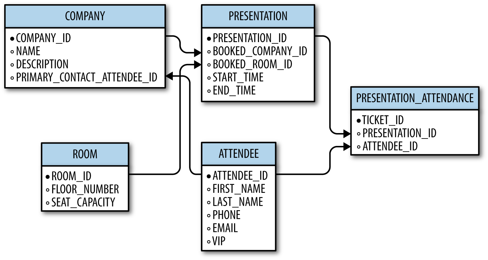
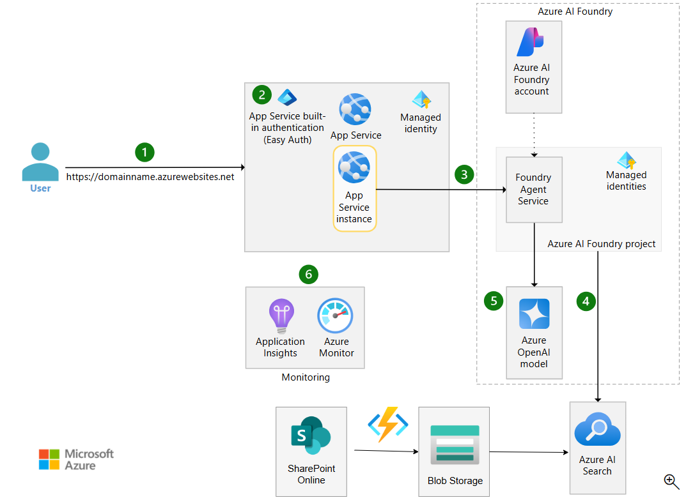

# GitHub Copilot Hackathon Guide 🚀

Welcome to the GitHub Copilot Hackathon! This guide contains hands-on exercises demonstrating Copilot's powerful capabilities using the files in this repository.

---

## 🎯 Prerequisites

- GitHub Copilot extension installed in VS Code
- GitHub Copilot Chat enabled
- Access to this repository's files

---

## Exercise 1: Vision - Database Schema to Code 📊

**File:** `DB-Schema.png`



**Objective:** Demonstrate Copilot's ability to understand images and generate code from visual diagrams.

### Prompt:
```
Using the image below, create the SQL DDL statements to build this database schema. Include:
- All tables with proper data types
- Primary keys and foreign key relationships
- Appropriate indexes for common queries

[Attach DB-Schema.png]
```

### Follow-up Prompts:
- "Now generate the Entity Framework Core models for this schema in C#"
- "Create a Python SQLAlchemy ORM mapping for these tables"
- "Generate sample INSERT statements with realistic test data"

---

## Exercise 2: Vision - Architecture Diagram Analysis 🏗️

**File:** `Diagram.png` or `Diagram (1).png`




**Objective:** Show how Copilot can interpret system architecture diagrams and generate implementation code.

### Prompt:
```
Analyze this architecture diagram and:
1. Describe the components and their interactions
2. Generate a README.md documenting this architecture
3. Create the folder structure for a project implementing this design

[Attach Diagram.png]
```

### Follow-up Prompts:
- "Generate Terraform/Bicep infrastructure-as-code for the cloud components shown"
- "Create Docker Compose configuration for local development of this architecture"
- "Write integration tests that verify the connections between these components"

---

## Exercise 3: Vision - UI Mockup to Code 🎨

**File:** `image (41).png`


**Objective:** Demonstrate Copilot's ability to convert UI mockups into functional code.

### Prompt:
```
Using this UI mockup, generate:
1. The HTML structure with semantic elements
2. CSS styles (or Tailwind classes) to match the design
3. JavaScript/TypeScript for any interactive elements

[Attach image (41).png]
```

### Follow-up Prompts:
- "Convert this to a React component with TypeScript"
- "Add accessibility features (ARIA labels, keyboard navigation)"
- "Generate unit tests for the component interactions"

---

## Exercise 4: Legacy Code Modernization 🔄

**File:** `MonthTable.cob`

**Objective:** Show Copilot's ability to understand and modernize legacy COBOL code.

### Prompt:
```
Analyze the COBOL code in MonthTable.cob and:
1. Explain what this program does in plain English
2. Identify the data structures and business logic
3. Convert this to modern Python with equivalent functionality
```

### Follow-up Prompts:
- "Now convert the same logic to C# with proper OOP patterns"
- "Create a REST API wrapper around this functionality using FastAPI"
- "Generate unit tests that verify the conversion maintains the same behavior"
- "What improvements would you suggest for the modernized version?"

---

## Exercise 5: Code Explanation & Documentation 📝

**File:** `MonthTable.cob`

**Objective:** Demonstrate Copilot's ability to explain complex or unfamiliar code.

### Prompt:
```
I've inherited this COBOL codebase. Please:
1. Create comprehensive documentation explaining each division and section
2. Generate a flowchart description of the program logic
3. Identify any potential bugs or improvements
4. Create an onboarding document for new developers
```

---

## Exercise 6: Security Analysis 🔒

**File:** Any generated code from previous exercises

**Objective:** Show Copilot's security analysis capabilities.

### Prompt:
```
Perform an OWASP Top 10 security analysis on this code:
1. Identify potential vulnerabilities
2. Rate each finding by severity
3. Provide remediation code examples
4. Suggest security best practices for this type of application
```

---

## Exercise 7: Test Generation 🧪

**File:** Any code file generated during the hackathon

**Objective:** Demonstrate automated test generation.

### Prompt:
```
Generate comprehensive tests for this code including:
1. Unit tests with edge cases
2. Integration test scenarios
3. Mock objects for external dependencies
4. Test data fixtures
5. Code coverage targets
```

---

## Exercise 8: Multi-File Project Scaffolding 🏭

**Objective:** Show Copilot's ability to scaffold entire projects.

### Prompt:
```
Using the database schema from DB-Schema.png, create a complete 
full-stack application with:

Backend:
- Node.js/Express API (or Python/FastAPI)
- Database models and migrations
- CRUD endpoints for all entities
- Input validation and error handling

Frontend:
- React/Vue/Angular SPA
- Forms for data entry
- Data display components
- API integration layer

Include:
- Docker configuration
- README with setup instructions
- Environment configuration
```

---

## 🏆 Bonus Challenges

### Challenge A: Cross-Language Translation
Take any generated code and ask Copilot to translate it to 3 different programming languages while maintaining idiomatic patterns for each.

### Challenge B: Performance Optimization
Ask Copilot to analyze generated code for performance issues and suggest optimizations with benchmarking code.

### Challenge C: DevOps Pipeline
Generate a complete CI/CD pipeline (GitHub Actions) for any of the projects created during the hackathon.

### Challenge D: API Documentation
Generate OpenAPI/Swagger documentation for any API created during the exercises.

---

## 📊 Evaluation Criteria

| Criteria | Points |
|----------|--------|
| Code correctness | 25 |
| Best practices followed | 20 |
| Documentation quality | 15 |
| Test coverage | 15 |
| Creative use of Copilot features | 15 |
| Security considerations | 10 |

---

## 💡 Tips for Success

1. **Be Specific**: The more context you provide in your prompts, the better the results
2. **Iterate**: Use follow-up prompts to refine and improve generated code
3. **Verify**: Always review and test generated code before using it
4. **Explore**: Try different approaches - ask Copilot for alternatives
5. **Learn**: Use `/explain` to understand unfamiliar code patterns

---

## 🔗 Useful Copilot Commands

| Command | Description |
|---------|-------------|
| `/explain` | Explain selected code |
| `/fix` | Fix issues in code |
| `/tests` | Generate tests |
| `/doc` | Generate documentation |
| `@workspace` | Query across your entire workspace |
| `#file` | Reference a specific file |
| `#selection` | Reference selected code |

---

## 📁 Repository Files Reference

| File | Use Case |
|------|----------|
| `DB-Schema.png` | Database design → Code generation |
| `Diagram.png` | Architecture → Implementation |
| `Diagram (1).png` | Alternative architecture exercise |
| `image (41).png` | UI mockup → Frontend code |
| `MonthTable.cob` | Legacy modernization |

---

Happy Hacking! 🎉
