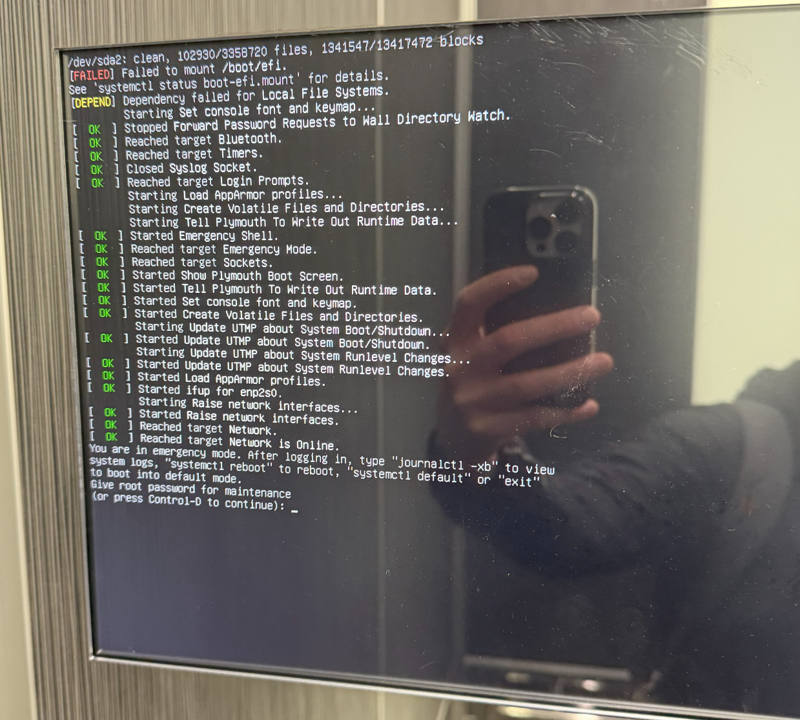

# GitHub Copilot Hackathon Guide 🚀

> 💡 **Credit:** Hackathon ideas and inspiration by
>
> <a href="https://github.com/jasonmoodie"></a>
>
> **[@jasonmoodie](https://github.com/jasonmoodie)**

Welcome to the GitHub Copilot Hackathon! This guide contains hands-on exercises demonstrating Copilot's powerful capabilities using the files in this repository.

---

## 🚀 Quick Start

```bash
# Clone the repository
git clone https://github.com/aj-enns/ghcp-hackathon.git

# Open in VS Code
code ghcp-hackathon
```

1. **Install recommended extensions** - VS Code will prompt you to install GitHub Copilot
2. **Open a prompt file** - Navigate to the `prompts/` folder and open any exercise
3. **Follow the instructions** - Each prompt file has step-by-step instructions
4. **Attach files/images** - Use the 📎 button in Copilot Chat to attach the referenced files

---

## 🎯 Prerequisites

- GitHub Copilot extension installed in VS Code
- GitHub Copilot Chat enabled
- Access to this repository's files

---

## 📋 Exercises

Click on any exercise to get started! Each prompt file contains step-by-step instructions.

| # | Exercise | Attachment | Copilot Capability |
|---|----------|------------|-------------------|
| 1 | [Database Schema to Code](prompts/01-database-schema.md) | `DB-Schema.png` | Vision - Generate SQL/ORM from diagrams |
| 2 | [Architecture Diagram Analysis](prompts/02-architecture-diagram.md) | `architectureDiagram.png` | Vision - Interpret system designs |
| 3 | [Elevator Error Troubleshooting](prompts/03-elevator-troubleshooting.md) | `elevator.png` | Vision - Diagnose issues from images |
| 4 | [Legacy COBOL Modernization](prompts/04-cobol-modernization.md) | `MonthTable.cob` | Code conversion to Python/C# |
| 5 | [Code Documentation](prompts/05-code-documentation.md) | `MonthTable.cob` | Auto-generate documentation |
| 6 | [Security Analysis](prompts/06-security-analysis.md) | Any generated code | OWASP Top 10 review |
| 7 | [Test Generation](prompts/07-test-generation.md) | Any generated code | Automated test creation |
| 8 | [Full-Stack Scaffolding](prompts/08-fullstack-scaffold.md) | `DB-Schema.png` | Complete project generation |

---

## 🖼️ Preview: Exercise Assets

### Exercise 1 & 8: Database Schema


### Exercise 2: Architecture Diagram


### Exercise 3: Elevator Error Code


---

## 📁 Repository Structure

```
ghcp-hackathon/
├── prompts/                    # 👈 Start here! Ready-to-use prompt files
│   ├── 01-database-schema.md
│   ├── 02-architecture-diagram.md
│   ├── 03-elevator-troubleshooting.md
│   ├── 04-cobol-modernization.md
│   ├── 05-code-documentation.md
│   ├── 06-security-analysis.md
│   ├── 07-test-generation.md
│   └── 08-fullstack-scaffold.md
├── DB-Schema.png               # Database schema diagram
├── architectureDiagram.png     # Architecture diagram
├── Diagram (1).png             # Alternative architecture diagram
├── elevator.png                # Elevator error code display
├── MonthTable.cob              # Legacy COBOL program
└── README.md                   # This file
```

---

## 🏆 Bonus Challenges

### Challenge A: Cross-Language Translation
Take any generated code and ask Copilot to translate it to 3 different programming languages while maintaining idiomatic patterns for each.

### Challenge B: Performance Optimization
Ask Copilot to analyze generated code for performance issues and suggest optimizations with benchmarking code.

### Challenge C: DevOps Pipeline
Generate a complete CI/CD pipeline (GitHub Actions) for any of the projects created during the hackathon.

### Challenge D: API Documentation
Generate OpenAPI/Swagger documentation for any API created during the exercises.

---

## 📊 Evaluation Criteria

| Criteria | Points |
|----------|--------|
| Code correctness | 25 |
| Best practices followed | 20 |
| Documentation quality | 15 |
| Test coverage | 15 |
| Creative use of Copilot features | 15 |
| Security considerations | 10 |

---

## 💡 Tips for Success

1. **Be Specific**: The more context you provide in your prompts, the better the results
2. **Iterate**: Use follow-up prompts to refine and improve generated code
3. **Verify**: Always review and test generated code before using it
4. **Explore**: Try different approaches - ask Copilot for alternatives
5. **Learn**: Use `/explain` to understand unfamiliar code patterns

---

## 🔗 Useful Copilot Commands

| Command | Description |
|---------|-------------|
| `/explain` | Explain selected code |
| `/fix` | Fix issues in code |
| `/tests` | Generate tests |
| `/doc` | Generate documentation |
| `@workspace` | Query across your entire workspace |
| `#file` | Reference a specific file |
| `#selection` | Reference selected code |

---

Happy Hacking! 🎉
